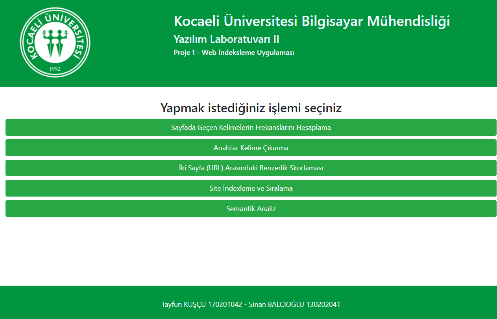

=== Web İndeksleme Uygulaması

_Verilen bir URL’deki web sayfa içeriğine göre
diğer birden fazla web sayfasını benzerlik
bakımından indeksleyip sıralayan web tabanlı bir
uygulama geliştirmek. Böylece bu proje sayesinde
web indeksleme yöntemleri hakkında bilgi
edinilmesini ve web tabanlı uygulama yazma
becerisinin geliştirilmesi amaçlanmaktadır._

*Projede web indeksleme alanındaki isterler 5
başlık altında incelenmiştir;*

* Sayfada Geçen Kelimelerin Frekanslarını Hesaplama
Anahtar Kelime Çıkarmak
* İki Sayfa (URL) Arasındaki Benzerlik
Skoru Hesaplama
* Site İndeksleme ve Sıralama
* Semantik Analiz

Her başlık ile alakalı işlemlerin sonucu ilgili
sayfanın sonuç sayfasında gösterilmektedir.

Uygulama Python dilinde Django framework’ü kullanılarak geliştirilmiştir. Verilen URL’lere istek gönderilmesi için request modülü, URL içeriklerine ulaşmak ve ayıklamak için BeautifulSoup modülü, sayfa tasarımları için ise Bootstrap kütüphanesi kullanılmıştır.

Gerekli modüllerin bulunması durumunda proje
klasörünün bulunduğu dizinde aşağıdaki komut
çalıştırılarak yerel sunucuda başlatılabilir.

[source,]
----
py .\manage.py runserver
----